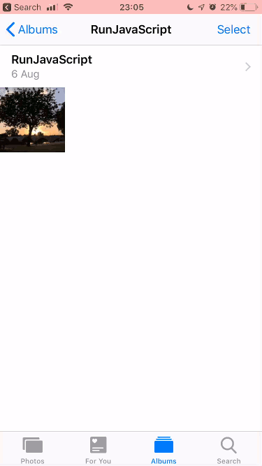

This sample adds a given text as a watermark on top of a chosen image. The example is based on Workflow and RunJavaScript Apps. For convenience, the script is embedded into a workflow. The workflow can be installed using this [link][1]. The script is included as `add_watermark.js` on GitHub for reference.

[install workflow][1]

[1]: https://www.icloud.com/shortcuts/beae98b2379e4c089f50acdf60e2173a

#### Demo

