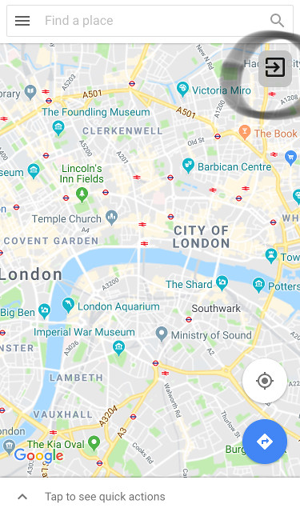
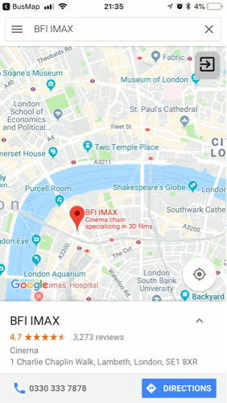

# Adding Custom Navigation Button to Google Maps
This script opens Google Maps and adds a new button to call `runjs.callBack(...)` function. After choosing a place on the map the button navigates to x-success URL including the location data as `input` parameter. 

### Sample response data returned through x-callback:
```
{
    address: "Science Museum Exhibition Rd",
    latitude: 51.4964981,
    longitude: -0.2516161,
    altitude: 13,
    url: "https://www.google.co.uk/maps/dir/51.502944,-0.259449/Science+Museum+Exhibition+Rd/@51.4964981,-0.2516161,13z/data=!3m2!4b1!5s0x4876055ccd3a7de3:0x68cad3184144cba0!4m15!1m6!3m5!1s0x487605431300da3f:0x21d54ea6148622de!2sScience+Museum!8m2!3d51.4978095!4d-0.1745235!4m7!1m0!1m5!1m1!1s0x487605431300da3f:0x21d54ea6148622de!2m2!1d-0.1745235!2d51.4978095"
}
```
### Demo Using Apple Shortcuts
Click to install [demo shortcut](https://www.icloud.com/shortcuts/1767c6323ed24569a0fb45d3e565867a)

### Screenshot of running script:


# Chaining Scripts
You can chain together scripts and use output of one script as input of another. Below is a sample script chaining [Google Maps Script](choose_location_on_google_maps.js) and [TFL Bus Timetable Script](../../tfl/tfl-bus.js). The coordinates provided by Google Maps Script will be used by Bus Stop script instead of current location (`choose_location_on_google_maps.js` and `tfl-bus.js` need to be stored in top level documents folder of RunJavaScript app).

### Sample chaining
```
runjs.openInSafari('runjavascript://x-callback-url/run?script=&file=choose_location_on_google_maps.js&x-success=runjavascript://x-callback-url/run%3Fscript%3D%26file%3Dtfl-bus.js')
```


