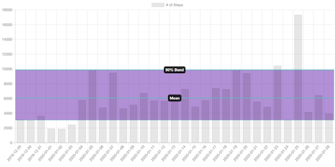
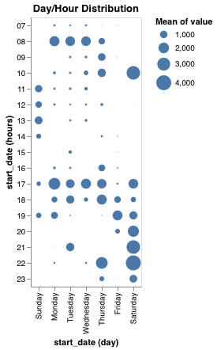

# Sample IOS Health Scripts

## Calculate Statistics for Number of Steps
Display statistics for number of steps for the last 90 days.
* [Get Shortcut](https://www.icloud.com/shortcuts/c4dadb9d658f4cf8a90177ae98d46358)
* [Source Code](steps_sample.js)

## Number of Steps as a Chart
Draw a chart of number of steps based on selected number of days (7, 30 or 90).
* [Get Shortcut](https://www.icloud.com/shortcuts/2c1a9a2332eb4d1a8805fac4b332dff7)
* [Source Code](steps_sample_with_chart.js)
### Sample Chart

## Plot Number of Steps as Bubbles
Plot an aggregated blob diagram of number of steps. The main magic happens on [Observable Notebook](https://observablehq.com/d/81c7f34bcbc42f79).
* [Get Shortcut](https://www.icloud.com/shortcuts/7921226ae34c4e4cbfa9a75557f3b592)
* [Source Code](https://observablehq.com/d/81c7f34bcbc42f79)
### Sample Plot
